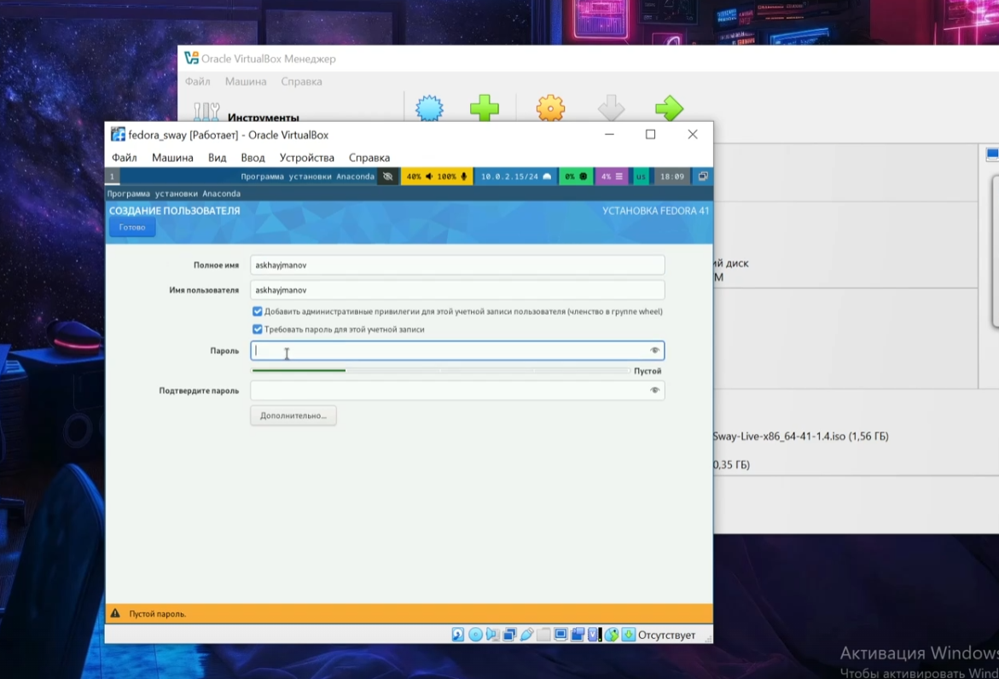
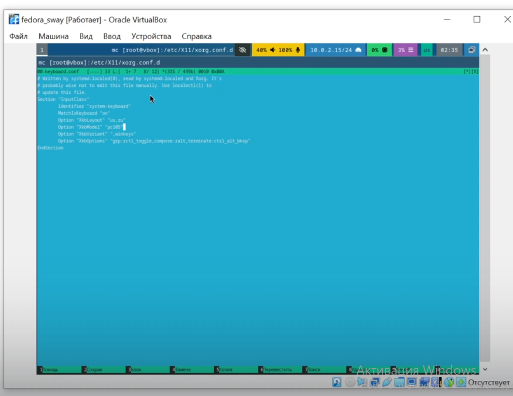
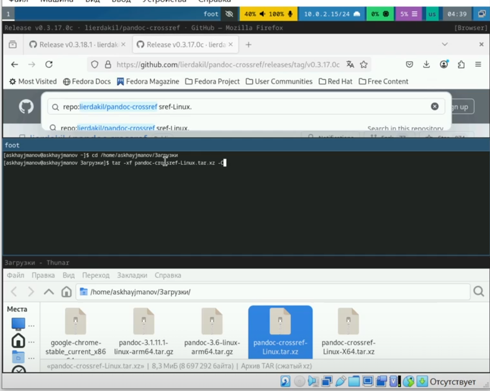

---
## Front matter
title: "Лабараторная работа 1"
subtitle: "Простейший вариант"
author: "Хайманов Асланбек Султанович"

## Generic otions
lang: ru-RU
toc-title: "Содержание"

## Bibliography
bibliography: bib/cite.bib
csl: pandoc/csl/gost-r-7-0-5-2008-numeric.csl

## Pdf output format
toc: true # Table of contents
toc-depth: 2
lof: true # List of figures
lot: true # List of tables
fontsize: 12pt
linestretch: 1.5
papersize: a4
documentclass: scrreprt
## I18n polyglossia
polyglossia-lang:
  name: russian
  options:
	- spelling=modern
	- babelshorthands=true
polyglossia-otherlangs:
  name: english
## I18n babel
babel-lang: russian
babel-otherlangs: english
## Fonts
mainfont: IBM Plex Serif
romanfont: IBM Plex Serif
sansfont: IBM Plex Sans
monofont: IBM Plex Mono
mathfont: STIX Two Math
mainfontoptions: Ligatures=Common,Ligatures=TeX,Scale=0.94
romanfontoptions: Ligatures=Common,Ligatures=TeX,Scale=0.94
sansfontoptions: Ligatures=Common,Ligatures=TeX,Scale=MatchLowercase,Scale=0.94
monofontoptions: Scale=MatchLowercase,Scale=0.94,FakeStretch=0.9
mathfontoptions:
## Biblatex
biblatex: true
biblio-style: "gost-numeric"
biblatexoptions:
  - parentracker=true
  - backend=biber
  - hyperref=auto
  - language=auto
  - autolang=other*
  - citestyle=gost-numeric
## Pandoc-crossref LaTeX customization
figureTitle: "Рис."
tableTitle: "Таблица"
listingTitle: "Листинг"
lofTitle: "Список иллюстраций"
lotTitle: "Список таблиц"
lolTitle: "Листинги"
## Misc options
indent: true
header-includes:
  - \usepackage{indentfirst}
  - \usepackage{float} # keep figures where there are in the text
  - \floatplacement{figure}{H} # keep figures where there are in the text
---

# Цель работы

Установка ОС на виртуальную машину, а также знакомство
с основными возможностями разметки Markdown.

# Задание
## 1 Установка операционной системы Fedora sway на виртуальную машину

## 2 Обновление и настройка ОС

## 3 Настройка раскладки клавиатуры

## 4 Работа с языком разметки Markdown

## 5 Выполнение домашнего задания

## 6 Ответы на контрольные вопросы

# Теоретическое введение

Здесь описываются теоретические аспекты, связанные с выполнением работы.

Например, в табл. [-@tbl:std-dir] приведено краткое описание стандартных каталогов Unix.

: Описание некоторых каталогов файловой системы GNU Linux {#tbl:std-dir}

| Имя каталога | Описание каталога                                                                                                          |
|--------------|----------------------------------------------------------------------------------------------------------------------------|
| `/`          | Корневая директория, содержащая всю файловую                                                                               |
| `/bin `      | Основные системные утилиты, необходимые как в однопользовательском режиме, так и при обычной работе всем пользователям     |
| `/etc`       | Общесистемные конфигурационные файлы и файлы конфигурации установленных программ                                           |
| `/home`      | Содержит домашние директории пользователей, которые, в свою очередь, содержат персональные настройки и данные пользователя |
| `/media`     | Точки монтирования для сменных носителей                                                                                   |
| `/root`      | Домашняя директория пользователя  `root`                                                                                   |
| `/tmp`       | Временные файлы                                                                                                            |
| `/usr`       | Вторичная иерархия для данных пользователя                                                                                 |

Более подробно про Unix см. в [@tanenbaum_book_modern-os_ru; @robbins_book_bash_en; @zarrelli_book_mastering-bash_en; @newham_book_learning-bash_en].

# Выполнение лабораторной работы

## 1 Установка операционной системы Fedora sway на виртуальную машину

{#fig:001 width=100%}
                
                  
## 2 Обновление и настройка ОС

{#fig:002 width=100%}

## 3 Настройка раскладки клавиатуры
   
{#fig:003 width=100%}

## 4 Работа с языком разметки Markdown

{#fig:004 width=100%}

## 5 Выполнение домашнего задания

{#fig:005 width=100%}

{#fig:006 width=100%}

## 6 Ответы на контрольные вопросы

- Получение справки по команде
  - Для получения справки по команде используется команда man (manual):
man <команда>
 
- Перемещение по файловой системе
  - Для перемещения по файловой системе используется команда cd (change directory):
cd <путь_к_каталогу>
 
- Просмотр содержимого каталога
  - Для просмотра содержимого каталога используется команда ls:
ls <путь_к_каталогу>

- Определение объёма каталога
  - Для определения объёма каталога используется команда du (disk usage):
du -sh <путь_к_каталогу>

- Создание / удаление каталогов / файлов
  - Для создания каталога используется команда mkdir:
mkdir <имя_каталога>
  - Для удаления каталога используется команда rm:
    rm <имя_каталога>
  - Для создания файла используется команда touch:
touch <имя_файла>

- Задание определённых прав на файл / каталог
  - Для задания прав используется команда chmod:
chmod <права> <имя_файла_или_каталога>

- Просмотр истории команд
  - Для просмотра истории команд используется команда history:
history
 
- Что такое файловая система?
  - Файловая система — это способ организации и хранения файлов на носителе данных. Она определяет, как данные хранятся и извлекаются. Примеры файловых систем:
  - ext4: Распространённая файловая система для Linux, поддерживает большие объёмы данных и имеет высокую производительность. 
  - NTFS: Файловая система, используемая в Windows, поддерживает большие файлы и сложные структуры данных. 
  - FAT32: Простая файловая система, совместимая с множеством операционных систем, но имеет ограничения на размер файлов (до 4 ГБ).
  
- Как посмотреть, какие файловые системы подмонтированы в ОС?
  - Для просмотра подмонтированных файловых систем используется команда df:
df -h

- Как удалить зависший процесс?
  - Для удаления зависшего процесса используется команда kill с указанием PID (идентификатора процесса):
kill <PID>

# Выводы

В процессе выполнения лабараторной работы 1 была установлена ОС федора, произошло ознакомление с ее основными командами.

# Список литературы{.unnumbered}

::: {#refs}
:::
