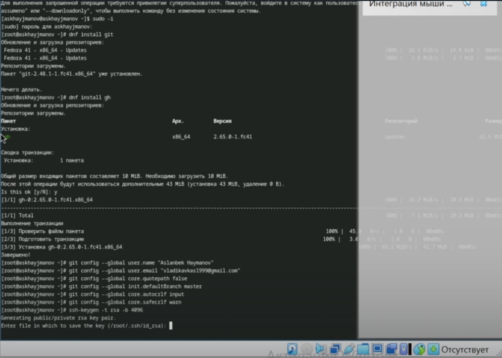
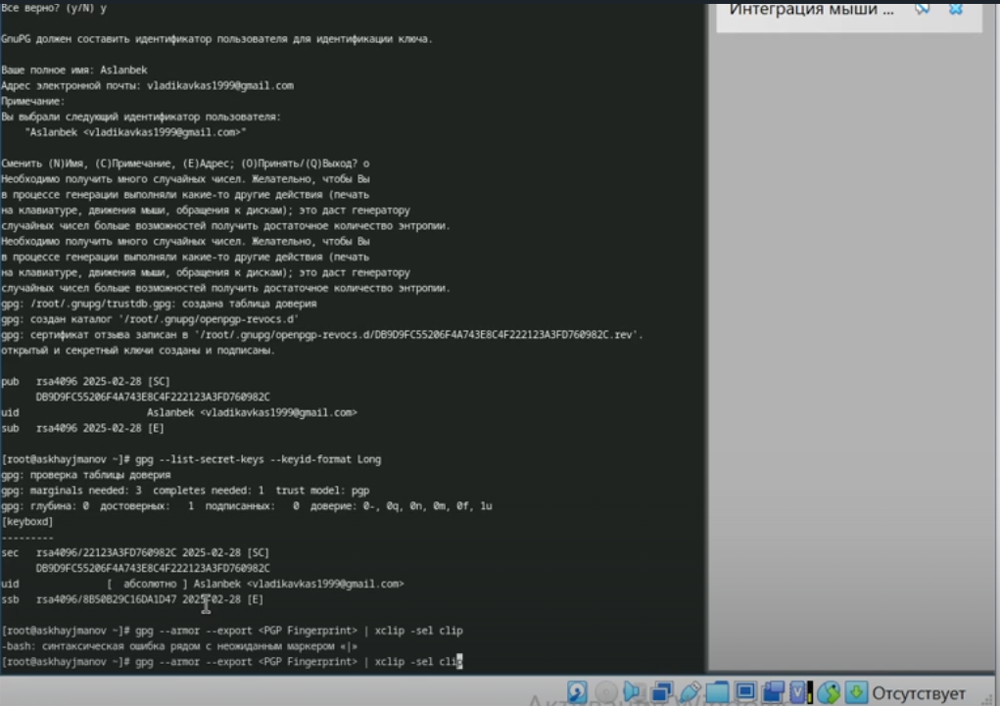
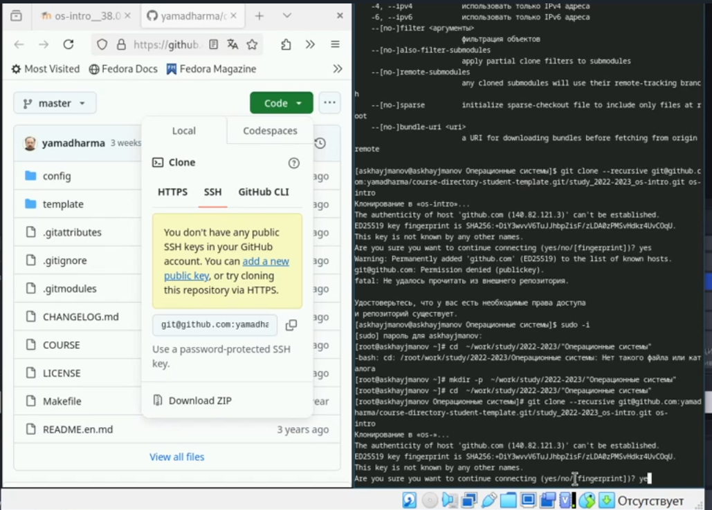

---
## Front matter
lang: ru-RU
title: Лабараторная работа 1
subtitle: Простейший шаблон
author:
  - Хайманов А.С.
institute:
  - Российский университет дружбы народов, Москва, Россия

date: 30 июля 1999

## i18n babel
babel-lang: russian
babel-otherlangs: english

## Formatting pdf
toc: false
toc-title: Содержание
slide_level: 2
aspectratio: 169
section-titles: true
theme: metropolis
header-includes:
 - \metroset{progressbar=frametitle,sectionpage=progressbar,numbering=fraction}
---

# Информация

## Докладчик

:::::::::::::: {.columns align=center}
::: {.column width="70%"}

  * Хайманов А.С
  * студент
  * Российский университет дружбы народов
  * [1132243810@pfur.ru](mailto:1132243810@pfur.ru)

:::
::: {.column width="30%"}

:::
::::::::::::::

# Вводная часть

## Актуальность

- Управление версиями
- Совместная работа
- Поддержка распределенной разработки
## Цели и задачи

- Изучить применение средств контроля версии
- освоить умения по работе с гит

## Материалы и методы

- Указанные в соответситвии с лабараторной работой

## Содержание исследования

## Установка и настройка git 

{#fig:001 width=100%}

## Создание ключей 

{#fig:002 width=100%}

## Настройка каталога курса

{#fig:002 width=100%}

## Контрольные вопросы

- Системы контроля версий (VCS) — это инструменты для отслеживания изменений в файлах и управления проектами. Они позволяют сохранять различные версии файлов, что упрощает возврат к предыдущим состояниям и совместную работу.

## Основные понятия VCS
  - Хранилище (Repository): Место, где хранятся файлы проекта и их история изменений.
  - Commit: Операция, сохраняющая изменения в хранилище с описанием внесённых изменений.
  - История (History): Последовательность всех коммитов, показывающая, как проект развивался.
  - Рабочая копия (Working Copy): Локальная версия файлов, с которой пользователь работает.

## Централизованные и децентрализованные VCS
  - Централизованные VCS: Один центральный сервер, к которому обращаются все пользователи. Примеры: Subversion (SVN), CVS.
  - Децентрализованные VCS: Каждый пользователь имеет полную копию репозитория. Примеры: Git, Mercurial.

## Действия с VCS при единоличной работе
  - Создание локального репозитория.
  - Внесение изменений в рабочую копию.
  - Сохранение изменений с помощью commit.
  - Просмотр истории изменений.
  - Возврат к предыдущим версиям.

## Порядок работы с общим хранилищем VCS
  - Клонирование удалённого репозитория.
  - Создание новой ветки.
  - Внесение изменений и commit.
  - Синхронизация изменений (push).
  - Получение изменений от других (pull).

## Основные задачи Git
  - Отслеживание изменений.
  - Управление версиями.
  - Слияние изменений.
  - Работа с ветками.
  - Возврат к предыдущим версиям.

## Команды Git
  - git init: Создаёт новый репозиторий.
  - git clone: Клонирует удалённый репозиторий.
  - git add: Добавляет изменения в индекс.
  - git commit: Сохраняет изменения.
  - git push: Отправляет изменения в удалённый репозиторий.
  - git pull: Получает изменения из удалённого репозитория.
  - git branch: Управляет ветками.

## Примеры использования
  - Локальный репозиторий:git init git add . git commit -m "Initial commit"
  - Удалённый репозиторий:git clone https://github.com/user/repo.git git push origin main

## Ветви позволяют создавать параллельные линии разработки, что полезно для работы над новыми функциями или исправлениями, не затрагивая основную ветку.

## Игнорирование файлов при commit

## Файл .gitignore используется для указания файлов и папок, которые Git должен игнорировать, чтобы избежать случайного коммита ненужных файлов. Это помогает поддерживать чистоту репозитория.
  
## Результаты

В процессе выполнения лабараторной работы 2 освоил умения по работе с гит

## Итоговый слайд

- Запоминается последняя фраза. © Штирлиц
- Главное сообщение, которое вы хотите донести до слушателей
- Избегайте использовать последний слайд вида *Спасибо за внимание*

