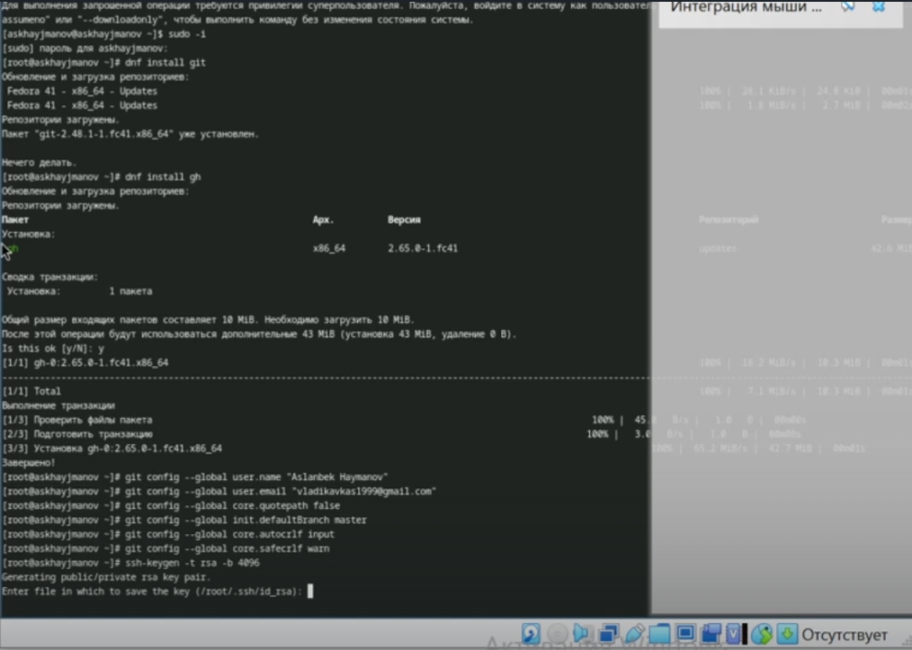
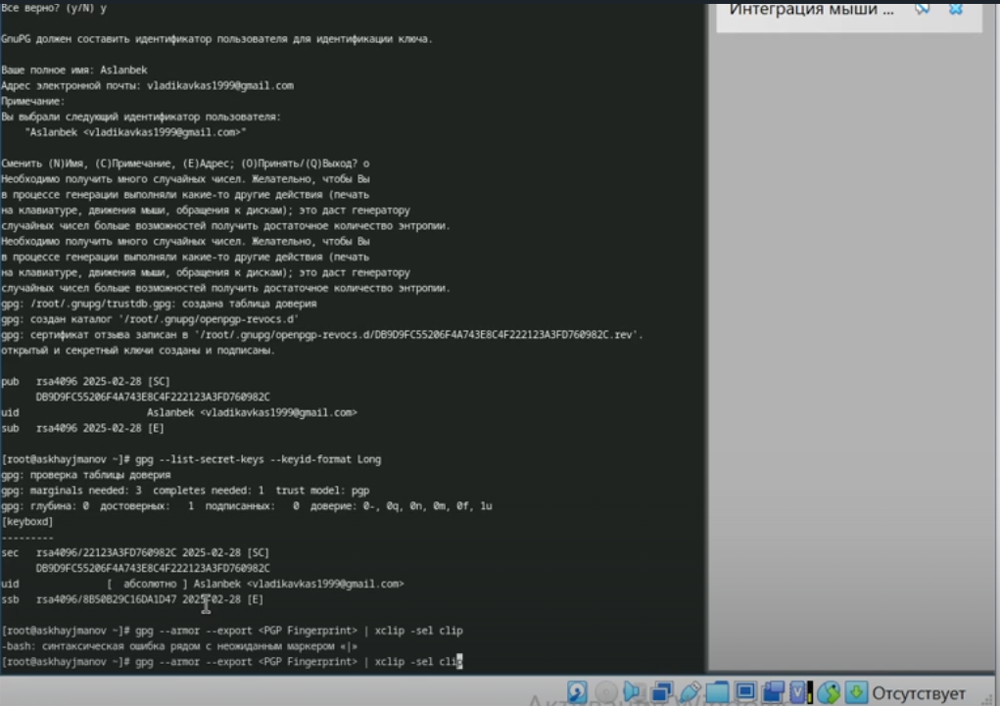
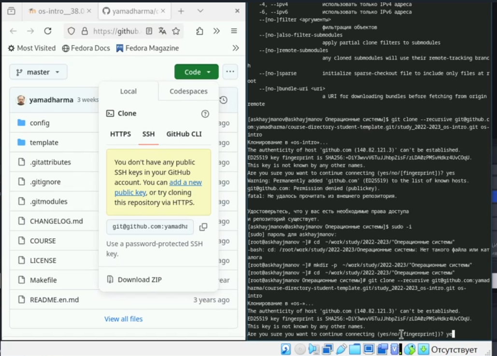

---
## Front matter
title: "Лабараторная работа 2"
subtitle: "Простейший вариант"
author: "Хайманов Асланбек Султанович"

## Generic otions
lang: ru-RU
toc-title: "Содержание"

## Bibliography
bibliography: bib/cite.bib
csl: pandoc/csl/gost-r-7-0-5-2008-numeric.csl

## Pdf output format
toc: true # Table of contents
toc-depth: 2
lof: true # List of figures
lot: true # List of tables
fontsize: 12pt
linestretch: 1.5
papersize: a4
documentclass: scrreprt
## I18n polyglossia
polyglossia-lang:
  name: russian
  options:
	- spelling=modern
	- babelshorthands=true
polyglossia-otherlangs:
  name: english
## I18n babel
babel-lang: russian
babel-otherlangs: english
## Fonts
mainfont: IBM Plex Serif
romanfont: IBM Plex Serif
sansfont: IBM Plex Sans
monofont: IBM Plex Mono
mathfont: STIX Two Math
mainfontoptions: Ligatures=Common,Ligatures=TeX,Scale=0.94
romanfontoptions: Ligatures=Common,Ligatures=TeX,Scale=0.94
sansfontoptions: Ligatures=Common,Ligatures=TeX,Scale=MatchLowercase,Scale=0.94
monofontoptions: Scale=MatchLowercase,Scale=0.94,FakeStretch=0.9
mathfontoptions:
## Biblatex
biblatex: true
biblio-style: "gost-numeric"
biblatexoptions:
  - parentracker=true
  - backend=biber
  - hyperref=auto
  - language=auto
  - autolang=other*
  - citestyle=gost-numeric
## Pandoc-crossref LaTeX customization
figureTitle: "Рис."
tableTitle: "Таблица"
listingTitle: "Листинг"
lofTitle: "Список иллюстраций"
lotTitle: "Список таблиц"
lolTitle: "Листинги"
## Misc options
indent: true
header-includes:
  - \usepackage{indentfirst}
  - \usepackage{float} # keep figures where there are in the text
  - \floatplacement{figure}{H} # keep figures where there are in the text
---

# Цель работы

Освоить умения по работе с git

# Задание

- Установка и настройка git 

- Создание ключей 

- Настройка каталога курса

- Контрольные вопросы

# Теоретическое введение

Здесь описываются теоретические аспекты, связанные с выполнением работы.

Например, в табл. [-@tbl:std-dir] приведено краткое описание стандартных каталогов Unix.

: Описание некоторых каталогов файловой системы GNU Linux {#tbl:std-dir}

| Имя каталога | Описание каталога                                                                                                          |
|--------------|----------------------------------------------------------------------------------------------------------------------------|
| `/`          | Корневая директория, содержащая всю файловую                                                                               |
| `/bin `      | Основные системные утилиты, необходимые как в однопользовательском режиме, так и при обычной работе всем пользователям     |
| `/etc`       | Общесистемные конфигурационные файлы и файлы конфигурации установленных программ                                           |
| `/home`      | Содержит домашние директории пользователей, которые, в свою очередь, содержат персональные настройки и данные пользователя |
| `/media`     | Точки монтирования для сменных носителей                                                                                   |
| `/root`      | Домашняя директория пользователя  `root`                                                                                   |
| `/tmp`       | Временные файлы                                                                                                            |
| `/usr`       | Вторичная иерархия для данных пользователя                                                                                 |

Более подробно про Unix см. в [@tanenbaum_book_modern-os_ru; @robbins_book_bash_en; @zarrelli_book_mastering-bash_en; @newham_book_learning-bash_en].

# Выполнение лабораторной работы

## Установка и настройка git 

{#fig:001 width=100%}

## Создание ключей 

{#fig:002 width=100%}

## Настройка каталога курса

{#fig:002 width=100%}

## Контрольные вопросы

- Системы контроля версий (VCS) — это инструменты для отслеживания изменений в файлах и управления проектами. Они позволяют сохранять различные версии файлов, что упрощает возврат к предыдущим состояниям и совместную работу.

- Основные понятия VCS
  - Хранилище (Repository): Место, где хранятся файлы проекта и их история изменений.
  - Commit: Операция, сохраняющая изменения в хранилище с описанием внесённых изменений.
  - История (History): Последовательность всех коммитов, показывающая, как проект развивался.
  - Рабочая копия (Working Copy): Локальная версия файлов, с которой пользователь работает.

- Централизованные и децентрализованные VCS
  - Централизованные VCS: Один центральный сервер, к которому обращаются все пользователи. Примеры: Subversion (SVN), CVS.
  - Децентрализованные VCS: Каждый пользователь имеет полную копию репозитория. Примеры: Git, Mercurial.

- Действия с VCS при единоличной работе
  - Создание локального репозитория.
  - Внесение изменений в рабочую копию.
  - Сохранение изменений с помощью commit.
  - Просмотр истории изменений.
  - Возврат к предыдущим версиям.

- Порядок работы с общим хранилищем VCS
  - Клонирование удалённого репозитория.
  - Создание новой ветки.
  - Внесение изменений и commit.
  - Синхронизация изменений (push).
  - Получение изменений от других (pull).

- Основные задачи Git
  - Отслеживание изменений.
  - Управление версиями.
  - Слияние изменений.
  - Работа с ветками.
  - Возврат к предыдущим версиям.

- Команды Git
  - git init: Создаёт новый репозиторий.
  - git clone: Клонирует удалённый репозиторий.
  - git add: Добавляет изменения в индекс.
  - git commit: Сохраняет изменения.
  - git push: Отправляет изменения в удалённый репозиторий.
  - git pull: Получает изменения из удалённого репозитория.
  - git branch: Управляет ветками.

- Примеры использования
  - Локальный репозиторий:git init git add . git commit -m "Initial commit"
  - Удалённый репозиторий:git clone https://github.com/user/repo.git git push origin main

- Ветви позволяют создавать параллельные линии разработки, что полезно для работы над новыми функциями или исправлениями, не затрагивая основную ветку.

- Игнорирование файлов при commit

- Файл .gitignore используется для указания файлов и папок, которые Git должен игнорировать, чтобы избежать случайного коммита ненужных файлов. Это помогает поддерживать чистоту репозитория.
  
# Выводы

В процессе выполнения лабараторной работы ознакомился с базовыми командами git

# Список литературы{.unnumbered}

::: {#refs}
:::
