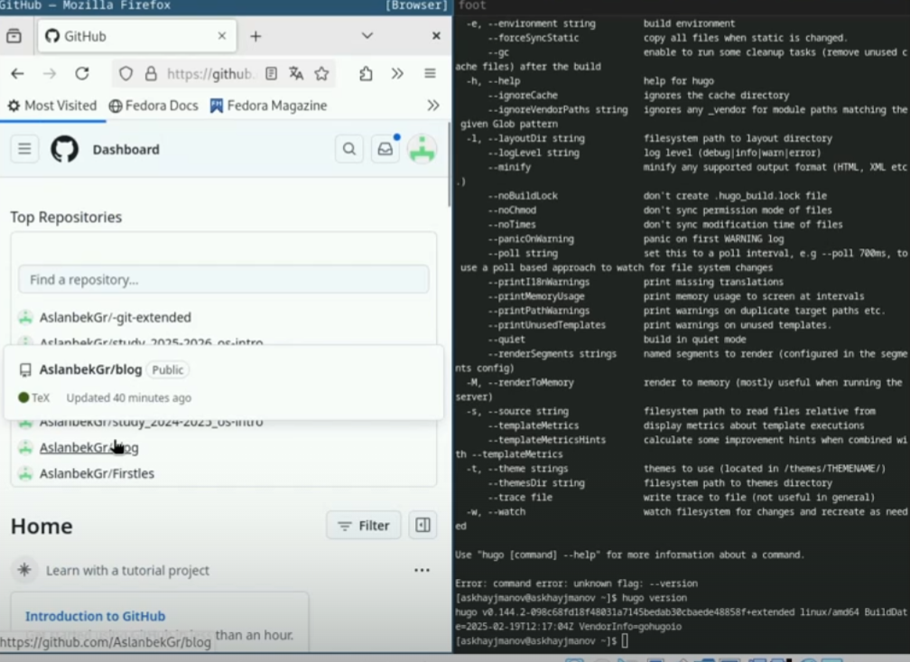
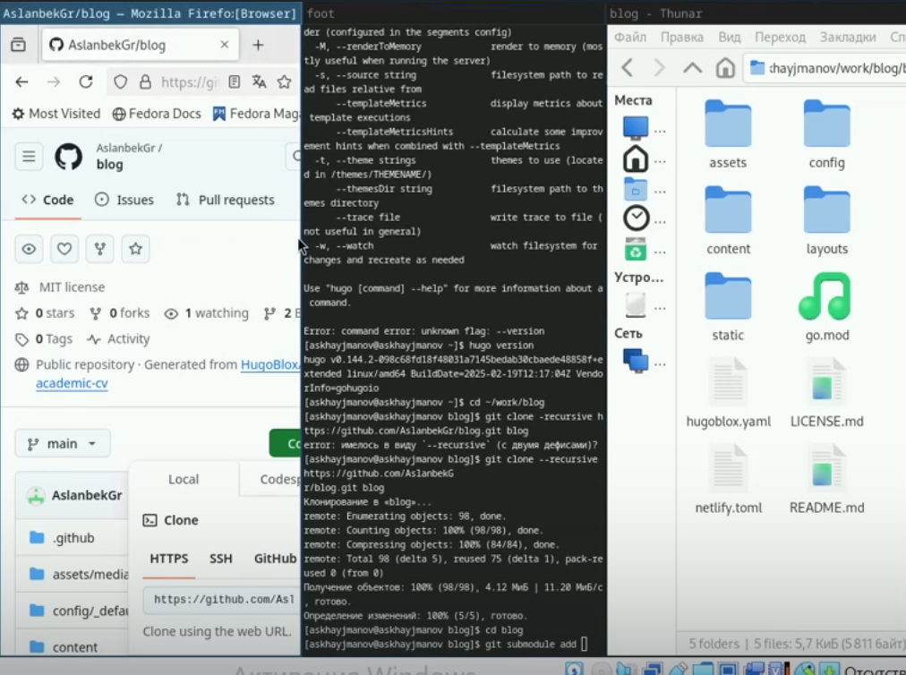
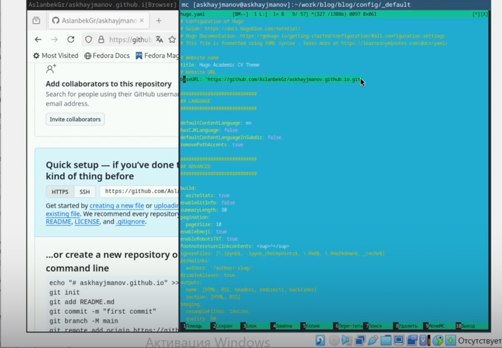
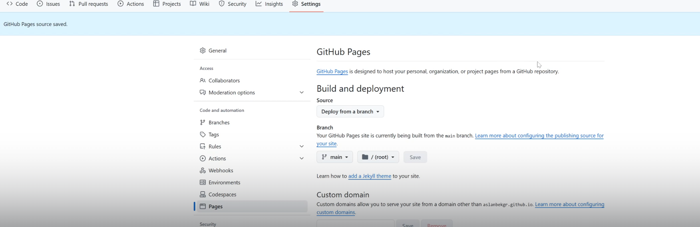

---
## Front matter
lang: ru-RU
title: Лабараторная работа 1
subtitle: Простейший шаблон
author:
  - Хайманов А.С.
institute:
  - Российский университет дружбы народов, Москва, Россия

date: 30 июля 1999

## i18n babel
babel-lang: russian
babel-otherlangs: english

## Formatting pdf
toc: false
toc-title: Содержание
slide_level: 2
aspectratio: 169
section-titles: true
theme: metropolis
header-includes:
 - \metroset{progressbar=frametitle,sectionpage=progressbar,numbering=fraction}
---

# Информация

## Докладчик

:::::::::::::: {.columns align=center}
::: {.column width="70%"}

  * Хайманов А.С
  * студент
  * Российский университет дружбы народов
  * [1132243810@pfur.ru](mailto:1132243810@pfur.ru)

:::
::: {.column width="30%"}

:::
::::::::::::::

# Вводная часть

## Актуальность

- Первое впечатление
- Доступность информации

## Цели и задачи

- Получение навыков заготовки сайта

## Материалы и методы

- Указанные в соответситвии с лабараторной работой

## Содержание исследования

## установить программное обеспечение
{#fig:001 width=100%}

## скачать шаблон темы сайта
{#fig:002 width=100%}

## установить параметр для юрл сайта
{#fig:003 width=100%}

## разместить заготовку сайта на гитхаб пейдж
{#fig:004 width=100%}

## Результаты

В процессе выполнения лабараторной работы получил навыки заготовки персонального сайта

## Итоговый слайд

- Запоминается последняя фраза. © Штирлиц
- Главное сообщение, которое вы хотите донести до слушателей
- Избегайте использовать последний слайд вида *Спасибо за внимание*

